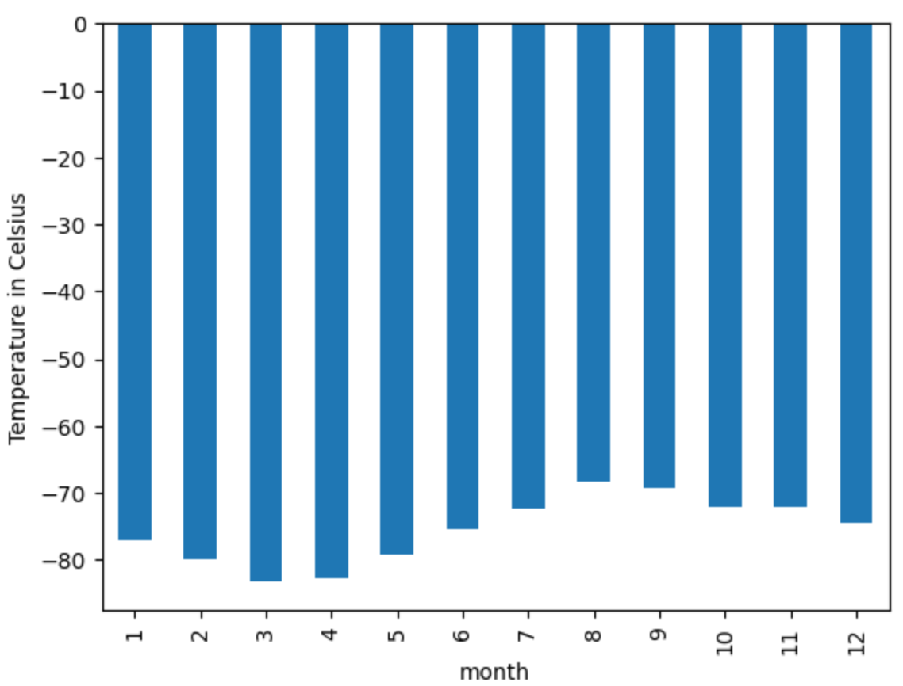
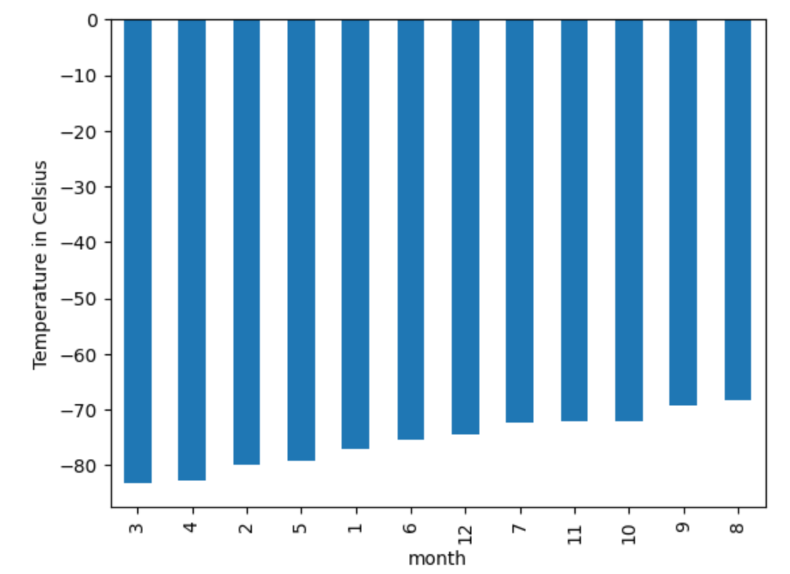
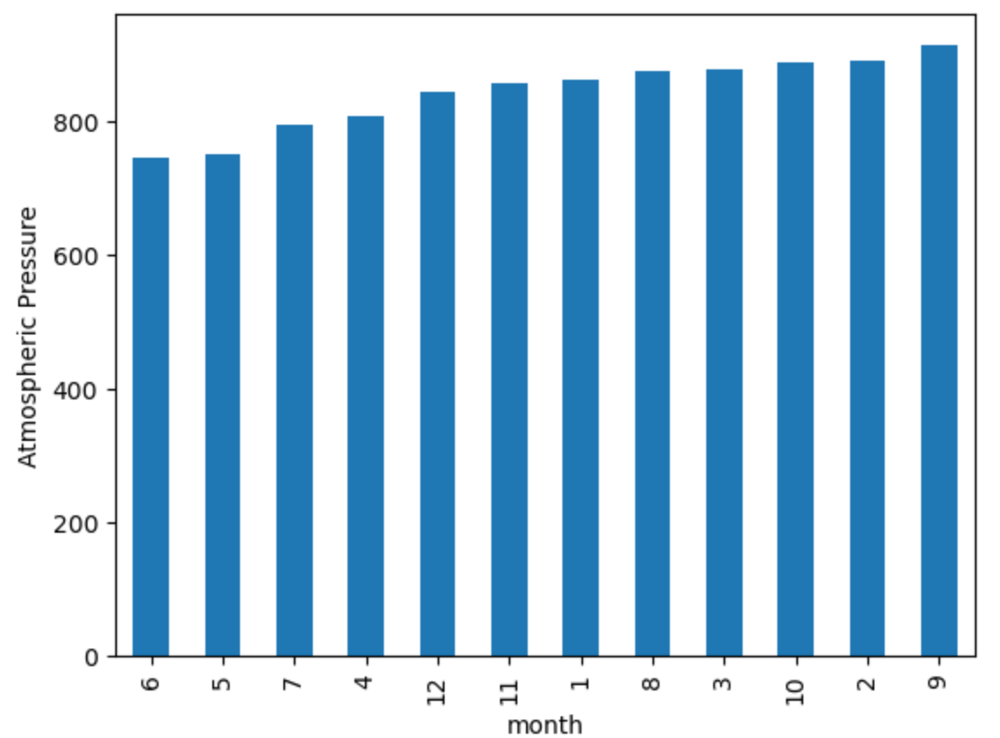
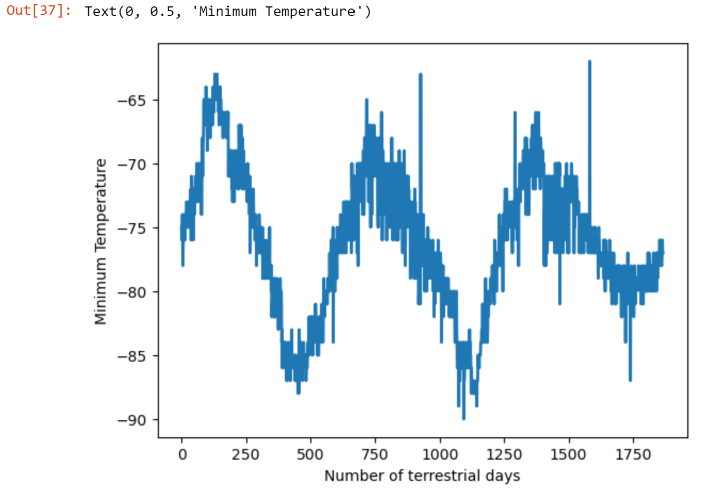

# webscraping-challenge

# Images

# Method
Watched class Zoom meeting from November 15, 2023 (Data-11.3-Data-Collection-Automated Browsing) to familiarize myself with process.
12/3/2023: Extra characters appear in lists between items: \n 
Update: Asked Instructor Khaled Karman for help during office hours 12/4/2023 with "\n". Advised to use ".strip()". Also asked about duplicate answers I was receiving. Advised that either cell containing "article" or "text_info" solution would work.
"\n" still appeared in result for Part 1. I'm leaving it as it helps to denote where a new line would start.  
12/10/2023: reviewed Day 3, 11.3 Data-Collection-solved for suggestions in removing "\n" from text. Utilized format where you name your equation and then use that name in the next solution. 
text_title = article.find("div", class_="content_title").text.strip()
    text_summary = {
        "title": text_title,
        "preview": text_article
    }
Unable to extract data rows from table into square brackets by row. Used read_html to extract table to data frame.

# Resources
The Mars News websiteLinks to an external site. is operated by edX Boot Camps LLC for educational purposes only. The news article titles, summaries, dates, and images were scraped from NASA's Mars NewsLinks to an external site. website in November 2022. Images are used according to the JPL Image Use PolicyLinks to an external site., courtesy NASA/JPL-Caltech.

Code converting 1 dimensional list to 2 dimensional DataFrame provided by Stack Overflow answer from "jezrael" on March 4, 2017 at 6:55 for "Convert 1D list into a (2D) pandas dataframe"

Code for using index as x-axis provided by Stack Overflow answer from "Clovis" on July 14, 2020 at 3:15 for "Scatter plot form dataframe with index on x-axis"